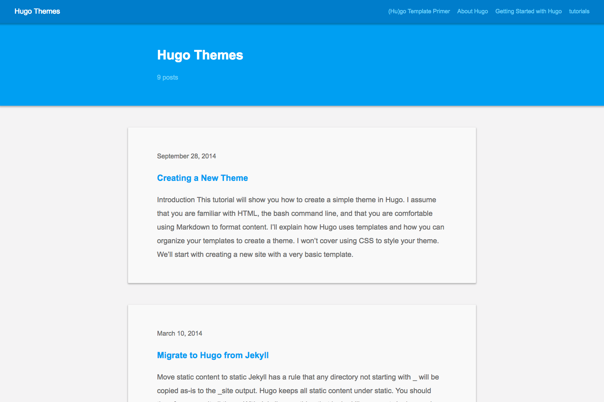
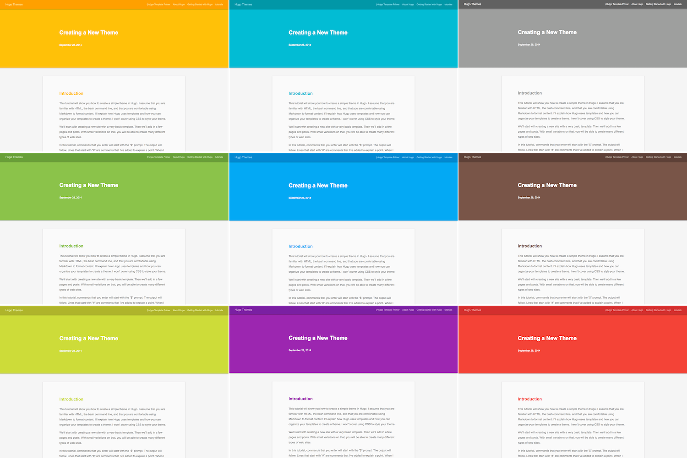

# Basic Material

Theme for [Hugo](https://gohugo.io/)




## Installation

Inside the directory of your Hugo site run:

```
cd themes
git clone https://github.com/miyagiy/hugo-basic-material.git
```

For more information read the [Install and Use Themes](https://gohugo.io/themes/installing-and-using-themes/)


## Theme Config

Please settings by your config file.

### Font size

`baseFontSize` set css font-size to html element.

default: `baseFontSize = "18px"`

### Font family

`fontFamily` set css font-family to html element.

default: `fontFamily = "Arial,'Helvetica Neue',sans-serif"`

### Date format

`dateFormat` is display date format by Hugo's [.Format](https://gohugo.io/functions/format/) function.

default: `dateFormat = "January 2, 2006"`

### Color Theme

You can change to your favorite color theme. 


#### Easy setting
Please set `primaryColorTheme` and `secondaryColorTheme`.  
Primary Color used to Header, Footer and h elements.   
Secondary Color used to links in articles.  
default:  
```
primaryColorTheme = "LightBlue"
secondaryColorTheme = "Amber"
```  
For the values that can be set, see the https://github.com/miyagiy/hugo-basic-material/blob/master/data/colors.toml.  
`colors.toml` is based on the MATERIAL DESIGN's [Tools for picking colors](https://material.io/design/color/the-color-system.html#tools-for-picking-colors).  

#### More detail setting

For the more detail setting, see the https://github.com/miyagiy/hugo-basic-material/blob/master/config.toml.  

## License

https://github.com/miyagiy/hugo-basic-material/blob/master/LICENSE.
